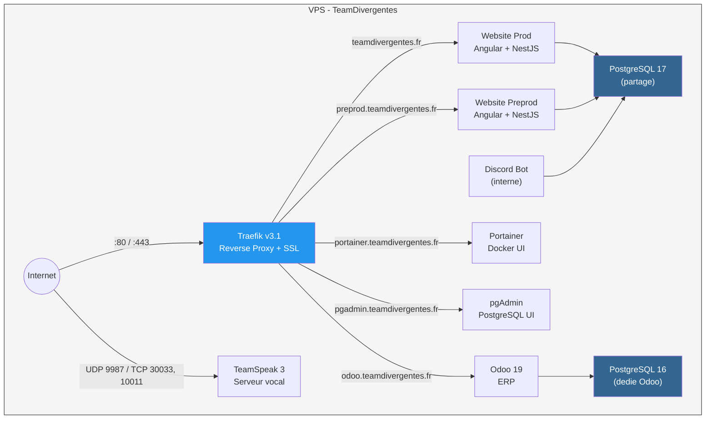

# VPS Infrastructure - TeamDivergentes

Infrastructure as Code pour le VPS TeamDivergentes, deployee via Ansible. 100% idempotent.

## Services

| Service | URL | Image | Description |
|---------|-----|-------|-------------|
| Website (prod) | `teamdivergentes.fr` / `www.teamdivergentes.fr` | `ghcr.io/.../dvg_web_backend` + `dvg_web_frontend` | Frontend Angular + Backend NestJS |
| Website (preprod) | `preprod.teamdivergentes.fr` | idem (tag `PREPROD`) | Meme stack, branche de dev |
| Odoo 19 | `odoo.teamdivergentes.fr` | `tellebma/isii_app:odoo-19-arm-latest` | ERP avec PostgreSQL 16 dedie |
| TeamSpeak 3 | `ts3.teamdivergentes.fr` | `teamspeak` (officiel) | Serveur vocal (UDP 9987, TCP 30033, 10011) |
| Discord Bot | *(interne)* | `ghcr.io/tellebma/discord-js-dvg` | Bot Discord.js |
| Portainer | `portainer.teamdivergentes.fr` | `portainer/portainer-ce` | Interface Docker |
| pgAdmin | `pgadmin.teamdivergentes.fr` | `dpage/pgadmin4` | Interface PostgreSQL |
| PostgreSQL 17 | *(interne)* | `postgres:17` | BDD partagee (website prod/preprod + discord) |
| Traefik v3 | ports 80/443 | `traefik:v3.1` | Reverse proxy + SSL Let's Encrypt |

## Architecture



### Strategie base de donnees

| Instance | Version | Databases | Justification |
|----------|---------|-----------|---------------|
| **Shared PG** | PostgreSQL 17 | dvg_prod, dvg_preprod, discord_bot | Economie RAM, isolation par users/grants |
| **Odoo PG** | PostgreSQL 16 | odoo19 | Odoo gere ses propres schemas, besoin CREATEDB |

## Prerequis

- Python 3.8+
- Ansible 2.15+
- Acces SSH au VPS

## Premiere installation (VPS vierge)

```bash
# 1. Generer une cle SSH si vous n'en avez pas
ssh-keygen -t ed25519 -C "deploy@teamdivergentes.fr"

# 2. Installer les dependances Ansible
ansible-galaxy install -r requirements.yml

# 3. Copier et remplir le vault (IP du VPS, cle SSH publique, mots de passe)
cp inventory/group_vars/all/vault.yml.example inventory/group_vars/all/vault.yml
vim inventory/group_vars/all/vault.yml

# 4. Chiffrer le vault
ansible-vault encrypt inventory/group_vars/all/vault.yml

# 5. Bootstrap : se connecte en root, durcit SSH, puis verifie en deploy
#    Phase 1 (root) : cree le user deploy, installe la cle SSH,
#                     active le firewall, desactive root + mot de passe
#    Phase 2 (deploy) : se reconnecte automatiquement en deploy,
#                       verifie la connexion
#    IMPORTANT: utiliser bootstrap_user/bootstrap_port (PAS ansible_user/ansible_port)
ansible-playbook bootstrap.yml \
  --ask-vault-pass \
  -e "bootstrap_user=root" \
  -e "bootstrap_port=22" \
  --ask-pass

# 6. Tester l'acces avec la nouvelle config
ssh deploy@<IP_DU_VPS>

# 7. Deployer toute l'infra (Docker, Traefik, apps...)
ansible-playbook site.yml --ask-vault-pass
```

## Mises a jour (runs suivants)

```bash
# Tout redeployer (idempotent, ne casse rien)
ansible-playbook site.yml --ask-vault-pass

# Ou seulement un service
ansible-playbook site.yml --ask-vault-pass --tags website
```

## Deploiement selectif (tags)

| Tag | Commande | Scope |
|-----|----------|-------|
| `common` | `--tags common` | Securite, SSH, firewall, updates |
| `docker` | `--tags docker` | Docker CE + Compose + GHCR login |
| `traefik` | `--tags traefik` | Reverse proxy + SSL |
| `postgresql` | `--tags postgresql` | BDD partagee PG 17 |
| `website` | `--tags website` | Site web (preprod + prod) |
| `odoo` | `--tags odoo` | Odoo 19 + PG 16 dedie |
| `teamspeak` | `--tags teamspeak` | TeamSpeak 3 |
| `discord` | `--tags discord` | Bot Discord.js |
| `portainer` | `--tags portainer` | Docker UI |
| `pgadmin` | `--tags pgadmin` | PostgreSQL UI |

```bash
ansible-playbook site.yml --ask-vault-pass --tags <tag>
```

## CI/CD (GitHub Actions)

Le pipeline se declenche automatiquement sur push vers `main`, ou manuellement via `workflow_dispatch` avec choix des tags.

Le job **lint** (ansible-lint) est en mode **Bonus** : il remonte les violations en warnings/annotations mais ne bloque jamais le deploiement.

### Secrets GitHub requis

| Secret | Description |
|--------|-------------|
| `SSH_PRIVATE_KEY` | Cle SSH privee (ed25519) |
| `SSH_PORT` | Port SSH du VPS |
| `VPS_IP` | Adresse IP du VPS |
| `ANSIBLE_VAULT_PASSWORD` | Mot de passe du vault Ansible |

### Trigger cross-repo

Les CI des apps (backend, frontend, discord-bot) declenchent ce workflow via `workflow_dispatch` apres avoir push leurs images Docker sur GHCR. Secrets requis dans les repos applicatifs : `DEPLOY_REPO`, `DEPLOY_TOKEN` (PAT avec `actions:write`).

## Securite

- **SSH** : cle ED25519 uniquement, root desactive, MaxAuthTries 3
- **Firewall UFW** : deny par defaut, seuls HTTP/HTTPS/TS3/SSH ouverts
- **Fail2ban** : ban 2h apres 3 tentatives
- **Traefik** : TLS 1.2+, HSTS, XSS protection, rate limiting
- **Docker** : `no-new-privileges`, reseaux internes isoles
- **BDD** : PostgreSQL jamais expose, isolation par users/grants
- **Mises a jour automatiques** : unattended-upgrades active
- **Kernel** : sysctl hardening (rp_filter, syncookies, no redirects)

## Structure

```
.
├── ansible.cfg                        # Configuration Ansible
├── site.yml                           # Playbook principal
├── bootstrap.yml                      # Bootstrap VPS vierge
├── requirements.yml                   # Dependances Galaxy
├── inventory/
│   ├── hosts.yml                      # Inventaire
│   └── group_vars/
│       └── all/
│           ├── main.yml               # Variables globales
│           ├── vault.yml              # Secrets chiffres (Ansible Vault)
│           └── vault.yml.example      # Template des secrets
├── roles/
│   ├── common/                        # Securite, SSH, firewall, updates
│   ├── docker/                        # Docker CE + Compose + GHCR
│   ├── traefik/                       # Reverse proxy + SSL auto
│   ├── postgresql/                    # PG 17 partage (website + discord)
│   ├── website/                       # Site web (preprod + prod)
│   ├── odoo/                          # Odoo 19 + PG 16 dedie
│   ├── teamspeak/                     # TeamSpeak 3
│   ├── discord-bot/                   # Bot Discord.js
│   ├── portainer/                     # Docker UI
│   └── pgadmin/                       # PostgreSQL UI
└── .github/
    └── workflows/
        └── deploy.yml                 # CI/CD pipeline
```
