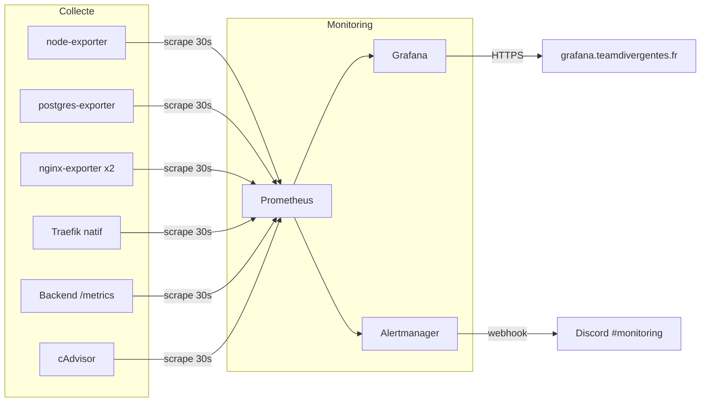

# SRE Monitoring — Team Divergentes

## Vue d'ensemble

Stack de monitoring self-hosted pour le VPS Team Divergentes (6 CPU / 12 Go RAM).

| Composant | Role | Port interne | Expose publiquement |
|-----------|------|-------------|---------------------|
| Prometheus | Collecte + stockage metriques | 9090 | Non |
| Grafana | Dashboards + visualisation | 3001 | Oui (`grafana.teamdivergentes.fr`) |
| Alertmanager | Routing alertes -> Discord | 9093 | Non |
| node-exporter | Metriques host (CPU, RAM, disk) | 9100 | Non |
| postgres-exporter | Metriques PostgreSQL | 9187 | Non |
| nginx-exporter | Metriques Nginx (stub_status) | 9113 | Non |

**Budget memoire total : ~750 Mo (caps Docker, incluant cAdvisor)**

## Documentation

| Fichier | Contenu |
|---------|---------|
| [architecture.md](architecture.md) | Architecture, composants, flux de donnees, fichiers impactes |
| [alertes.md](alertes.md) | Regles d'alerte, severites, routing Discord |
| [dashboards.md](dashboards.md) | Specification des 5 dashboards Grafana |
| [resource-limits.md](resource-limits.md) | Limits CPU/RAM Docker pour tous les containers du VPS |

## Decisions prises

| Decision | Choix | Raison |
|----------|-------|--------|
| Stack | Prometheus + Grafana self-hosted | Pas de dependance externe, 30j retention, standard industrie |
| Alertes | Discord webhook (`#monitoring`) | Coherent avec les notifs de deploy existantes |
| Retention | 30 jours / 1 Go max (whichever first) | Analyse de tendance mensuelle sans exploser le disque |
| Scrape interval | 30s | Divise la charge par 2 vs 15s, suffisant pour du monitoring infra |
| Acces Grafana | Traefik + basicAuth + login Grafana | Double couche d'auth, pas de port supplementaire a ouvrir |
| Discord bot | Container liveness (pas de /metrics) | Le bot n'expose pas de metriques — on surveille sa presence |
| Port Grafana | 3001 | Evite le conflit avec le backend NestJS (3000) |

## Prerequis

- Webhook Discord pour le channel `#monitoring`
- Mot de passe admin Grafana (vault Ansible)
- Credentials basicAuth Traefik pour Grafana (vault Ansible)
- `DATA_SOURCE_NAME` pour postgres-exporter (vault Ansible)
