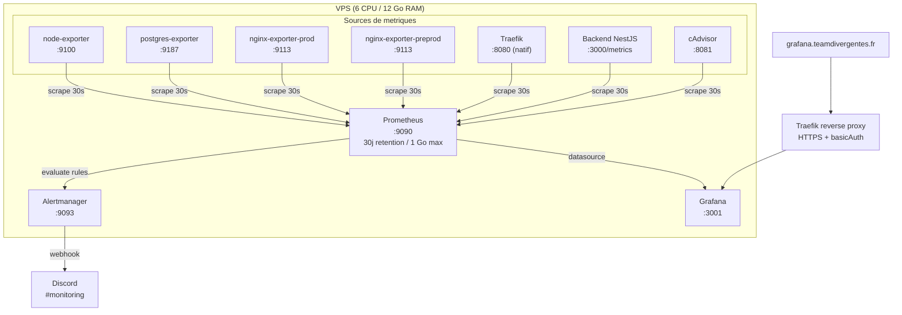
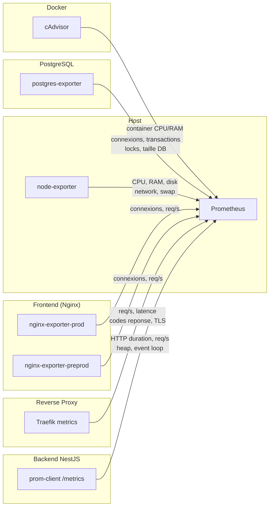
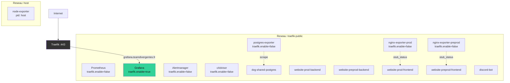

# Architecture Monitoring

## Schema global



## Flux de scrape



## Sources de metriques

### node-exporter (host)

Metriques systeme du VPS via les namespaces host.

```yaml
# Flags Docker requis
pid: host
network_mode: host
volumes:
  - /proc:/host/proc:ro
  - /sys:/host/sys:ro
  - /:/rootfs:ro
command:
  - --path.procfs=/host/proc
  - --path.sysfs=/host/sys
  - --path.rootfs=/rootfs
  - --collector.filesystem.mount-points-exclude=^/(sys|proc|dev|host|etc)($$|/)
```

Metriques exposees : CPU, RAM, swap, disk I/O, filesystem usage, network I/O, load average, entropy.

### postgres-exporter (PostgreSQL)

Scrape `dvg-shared-postgres` via `DATA_SOURCE_NAME` (connection string dans le vault).

Metriques exposees : connexions actives/idle/waiting, transactions/s, tuples fetched/returned/inserted/updated/deleted, locks, taille des bases, replication lag, dead tuples (vacuum).

Le DSN cible le user `shared_pg_user` avec acces a `pg_stat_*` views.

### nginx-exporter (Nginx frontend)

Scrape le `stub_status` endpoint des containers frontend.

**Modification requise** sur `frontend/nginx.conf` :

```nginx
# Ajout d'un server block interne pour stub_status
server {
    listen 8080;
    server_name _;
    location /stub_status {
        stub_status;
        allow 172.16.0.0/12;  # Reseau Docker uniquement
        deny all;
    }
}
```

L'exporter scrape `http://website-{env}-frontend:8080/stub_status` et expose sur `:9113/metrics`.

**Note** : un seul nginx-exporter peut scraper un seul upstream. Pour preprod + prod, deux options :
- 2 instances nginx-exporter (recommande, +10 Mo RAM)
- 1 instance qui scrape uniquement prod (simplifie)

Recommandation : 2 instances (`nginx-exporter-prod` + `nginx-exporter-preprod`).

### Traefik (natif)

Ajout dans `traefik.yml.j2` :

```yaml
metrics:
  prometheus:
    entryPoint: metrics
    addEntryPointsLabels: true
    addRoutersLabels: true
    addServicesLabels: true

entryPoints:
  # ... existants (web, websecure) ...
  metrics:
    address: ":8080"
```

Metriques exposees : requetes/s par router/service/entrypoint, duree des requetes (histogramme), codes de reponse, TLS cert expiry, connexions ouvertes.

### Backend NestJS (prom-client)

Nouveau module `MetricsModule` dans le backend :

```
backend/src/metrics/
  metrics.module.ts       # Module NestJS
  metrics.controller.ts   # GET /metrics (public, no auth)
  metrics.service.ts      # Registry prom-client
  metrics.interceptor.ts  # Intercepteur HTTP global (duration + count)
```

Metriques custom :
- `http_request_duration_seconds` (histogram, labels: method, route, status_code)
- `http_requests_total` (counter, labels: method, route, status_code)
- Default Node.js metrics (`collectDefaultMetrics`) : heap, GC, event loop lag, active handles

L'endpoint `/metrics` est exclu du JWT guard global (meme pattern que `/health`).

### Discord bot

Le bot ne dispose pas de serveur HTTP et n'expose pas de `/metrics`.

**Strategie de monitoring :**
1. **Container liveness** : Prometheus scrape le Docker healthcheck status via les metriques Traefik/Docker ou une probe custom
2. **Log monitoring** : Les logs sont ecrits dans `/opt/apps/discord-bot/logs/` (bind mount). Une alerte se declenche si le container est `unhealthy` ou `stopped` pendant > 2 min
3. **Restart tracking** : Alerte si le container redemarre > 3 fois en 15 min

Implementation concrete : Prometheus utilise une `probe` ou un job de type `blackbox` simplifie. Alternative plus simple : un script cron sur le host qui verifie `docker inspect --format='{{.State.Health.Status}}' discord-bot` — mais ca sort du paradigme Prometheus.

**Recommandation retenue** : Utiliser les metriques Docker engine. Prometheus scrape le Docker daemon (si l'experimental metrics endpoint est active) ou on ajoute **cAdvisor** (~30 Mo RAM) qui expose les metriques de tous les containers (CPU, RAM, restarts, status). Cela couvre aussi Odoo, TeamSpeak, et tout le reste.

Avec cAdvisor, le budget RAM monte a **~660 Mo** (vs 630 Mo initialement).

## Reseau

Tous les containers monitoring sont sur `traefik-public` (reseau Docker partage existant).



| Container | traefik.enable | Raison |
|-----------|---------------|--------|
| Prometheus | false | Interne uniquement |
| Grafana | **true** | Expose via `grafana.teamdivergentes.fr` |
| Alertmanager | false | Interne uniquement |
| node-exporter | false | host network mode |
| postgres-exporter | false | Interne uniquement |
| nginx-exporter-prod | false | Interne uniquement |
| nginx-exporter-preprod | false | Interne uniquement |
| cAdvisor | false | Interne uniquement |

## Fichiers impactes

### Nouveaux fichiers (role `monitoring`)

```
ansible_vps/roles/monitoring/
  tasks/main.yml                          # Deploiement du role
  templates/
    docker-compose.yml.j2                 # Stack monitoring complete
    prometheus/
      prometheus.yml.j2                   # Config Prometheus (scrape jobs)
      alert-rules.yml.j2                  # Regles d'alerte
    alertmanager/
      alertmanager.yml.j2                 # Config Alertmanager (Discord webhook)
    grafana/
      grafana.ini.j2                      # Config Grafana (auth, server, paths)
      provisioning/
        datasources/prometheus.yml.j2     # Datasource auto-provisionee
        dashboards/dashboards.yml.j2      # Provider de dashboards
      dashboards/
        01-overview.json                  # Vue d'ensemble
        02-host-node.json                 # Metriques host
        03-postgresql.json                # Metriques PostgreSQL
        04-traefik-nginx.json             # Metriques Traefik + Nginx
        05-backend-nestjs.json            # Metriques backend
```

### Fichiers existants modifies

| Fichier | Modification |
|---------|-------------|
| `ansible_vps/site.yml` | Ajout role `monitoring` (apres `website`, avant `portainer`) |
| `ansible_vps/inventory/group_vars/all/main.yml` | Variables : `grafana_domain`, `monitoring_retention_time`, `monitoring_retention_size`, `scrape_interval` |
| `ansible_vps/inventory/group_vars/all/vault.yml.example` | Secrets : `vault_grafana_admin_password`, `vault_grafana_basicauth_users`, `vault_discord_monitoring_webhook`, `vault_pg_exporter_dsn` |
| `ansible_vps/roles/traefik/templates/traefik.yml.j2` | Ajout bloc `metrics.prometheus` + entrypoint `metrics:8080` |
| `ansible_vps/roles/traefik/templates/docker-compose.yml.j2` | Expose port `8080` en interne (pas sur le host) |
| `ansible_vps/roles/website/templates/docker-compose-website.yml.j2` | Ajout `mem_limit` + `cpus` sur backend + frontend |
| `ansible_vps/roles/postgresql/templates/docker-compose.yml.j2` | Ajout `mem_limit` + `cpus` |
| `ansible_vps/roles/discord-bot/templates/docker-compose.yml.j2` | Ajout `mem_limit` + `cpus` |
| `ansible_vps/roles/portainer/templates/docker-compose.yml.j2` | Ajout `mem_limit` + `cpus` |
| `ansible_vps/roles/pgadmin/templates/docker-compose.yml.j2` | Ajout `mem_limit` + `cpus` |
| `frontend/nginx.conf` | Ajout server block `stub_status` sur port 8080 |
| `backend/src/metrics/` (nouveau module) | `prom-client` : controller, service, interceptor |
| `backend/src/app.module.ts` | Import `MetricsModule` |

### Fichiers NON modifies

| Fichier | Raison |
|---------|--------|
| `ansible_vps/roles/common/tasks/main.yml` | Pas de port UFW a ouvrir (Grafana passe par Traefik sur 443) |
| `ansible_vps/roles/odoo/` | Odoo a ses propres limits applicatives, pas de changement |
| `ansible_vps/roles/teamspeak/` | Pas de metriques pertinentes pour le moment |
